### ROBO-ONE_Beginners_VisionAI
# Electronic_Circuit

## 概要
Raspi5とカメラを使用し画像処理や深層強化学習などフィジカルAIの学習が電子回路に詳しくなくても可能なものとします。
- cpu: Raspi5 RAM 4Gbyte以上　SDカード 64Gbyte以上
- Raspi Camera csi接続
- Hat:5v電源 serial servo control/ i2c/ fan control/ RTC
- IMU BNO055など i2c接続
- ADC ADS1115など i2c接続

### 全体図
まずはカメラとIMUでどこまでいけるかトライして頂けることを期待します。TofセンサーとPSDセンサーは搭載していません。PSDセンサーは必要なら搭載できるようBKTは準備しました。ハットを使用しできるだけはんだ付けを少なくしました。

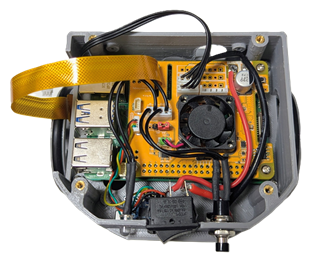

### Raspi5
ここではRaspi5を使用します。Raspi4でもほとんどのサンプルは動作しますが遅くです。スタートとして使用するには可能です。メモリーは4G以上あれば良いでしょう。


[Raspi5購入先](https://www.amazon.co.jp/dp/B0CPDJ8FNK?ref=ppx_yo2ov_dt_b_fed_asin_title)

### Hat
はんだ付けの極力避けるため以下のHatを使用します。Serial servo controlや電源、Fanが搭載されており、コンパクトで搭載性が非常に良いものです。

#### (BTE100B)(仕様変更中)


[HAT購入先](https://www.besttechnology.co.jp/modules/knowledge/?BTE100B%20DXHAT)

#### HeatSink
画像処理を行うには電力消費が増大するためヒートシンクとFanの搭載が不可欠です。
以下のヒートシンクをRaspi5の赤丸部に貼り付けた後にハットを取り付けてください。


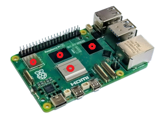

[Heatsink購入先](https://www.amazon.co.jp/dp/B0F8V6TK9M?ref=ppx_yo2ov_dt_b_fed_asin_title&th=1)

#### 電源廻り
電源スイッチはHatの電源入力とバッテリー接続コネクターの間に接続し写真のように取り付けます。ただしOSを週利用したのち電源スイッチを切るようにしてください。
右側のまどからRaspi5のスイッチが見えます。PCと接続していない場合はこのスイッチを長押ししてください。同じ窓から見えるLEDが赤くなってから電源を落として下さい。


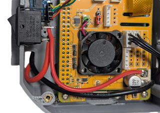

このスイッチは以下より入手できます。

[sw購入先](https://www.amazon.co.jp/dp/B09QJQ55F8?ref=ppx_yo2ov_dt_b_fed_asin_title&th=1)

### CSI camera
Raspiカメラは以下を使用します。


ハットを搭載する前にcam/disp 0にフラットケーブルを挿入しておきます。

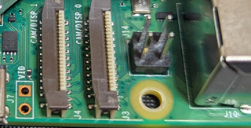

#### camera: csi
Raspiカメラには以下のものがあります。レンズはFOV違いでいろいろありますが、130°程度が画像のひずみ変形も少なく使いやすいでしょう。

[Raspberry Pi 5 カメラ 5MP 1080P 130°](https://ja.aliexpress.com/item/1005006790000090.html?pvid=09bf0cac-d03c-4739-89cf-66528290c2b3&pdp_ext_f=%7B%22ship_from%22%3A%22CN%22%2C%22sku_id%22%3A%2212000038354130022%22%7D&scm=1007.25281.487460.0&scm-url=1007.25281.487460.0&scm_id=1007.25281.487460.0&pdp_npi=6%40dis%21JPY%21%EF%BF%A5+781%21%EF%BF%A5+248%21%21%2132.86%2110.43%21%40213ba0c517767581979563570e81e7%2112000038354130022%21gdf%21JP%213303977755%21X%211%210%21n_tag%3A-29919%3Bd%3Aca1dc3a9%3Bm03_new_user%3A-29895%3BpisId%3A5000000204357513&mainPicRatio=1&spm=a2g0o.tm1000062330.3974233040.d80&aecmd=true)

[1080Pミニカメラモジュール160°広角 購入先](https://www.amazon.co.jp/dp/B0D2BMH1BB?ref=ppx_yo2ov_dt_b_fed_asin_title)

#### Flexible cable
フラットケーブルは10～15cmの長さのものを使用します。

[CSIケーブル 15-22pin FPC フレキシブル 100mm購入先](https://www.amazon.co.jp/dp/B0DNFP5QJR?ref=ppx_yo2ov_dt_b_fed_asin_title&th=1)

### 入出力
#### IMU bno055
I2CにQWICコネクターで接続します。ROBO-ONE Beginners autoと同様に接続してください。


[Qwic I2C コネクター購入先](https://www.amazon.co.jp/elechawk-%E3%82%B1%E3%83%BC%E3%83%96%E3%83%AB%E3%82%AD%E3%83%83%E3%83%88-SparkFun-%E3%82%BB%E3%83%B3%E3%82%B5%E3%83%BC%E3%83%9C%E3%83%BC%E3%83%89-%E3%83%96%E3%83%AC%E3%83%BC%E3%82%AF%E3%82%A2%E3%82%A6%E3%83%88/dp/B08HQ1VSVL/ref=sr_1_2?crid=3W19Q2ONT0LIL&dib=eyJ2IjoiMSJ9.YuuEcK_ekR-oT7oZ3T7B2-mq60LeJaWuKdOGL3M54VnI3GcrDBERKl2zRIZOBNqdtYEHiFv1bQHApo6wdtef7-8knjGdsJ9VCkPyDRP71-a2E4vpPMQfPdNNscUzjM7IGbLyMHZ4Sk_ukKUVycNb1zesaJzorhxZp5hz8CVKoW_py8efPvRY2S3L8P7MFuVT4RiGDV6PQpJ-GR-KzpB6Tm-DlEZFvEeD_FSvOUeK7xCzYIR_5-Uaqe7NriJ0GoW8LwETYkm4vytQUDagfLa-BTmQnajFNz5ro01Tyagn9_o.Sq6qsz4HRhtd0IDGkuFrTUYn0ILrt_truz1L9vYpKCc&dib_tag=se&keywords=qwic+%E3%82%B1%E3%83%BC%E3%83%96%E3%83%AB&qid=1776863068&sprefix=qwic+%2Caps%2C260&sr=8-2&ufe=app_do%3Aamzn1.fos.bf5b3200-08a5-4406-bf4b-e679e8ebbcc3)

CPU caseには下の写真のように配置します。ロボットの前後がX軸、左右がY軸、基板面に垂直な方向がZ軸です。

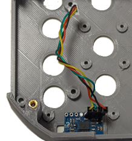

#### push sw　および LED
push sw　および LEDはROBO-ONE Beginners autoと同じものが使用できます。以下のものも使えamazonでも入手できます。


[push_sw購入先](https://www.amazon.co.jp/dp/B0D4PX1V4Q?ref=ppx_yo2ov_dt_b_fed_asin_title)

回路図は以下の通りで、スイッチのプルアップ抵抗はRaspi5の内部でブルアップすれば取り付ける必要はありません。

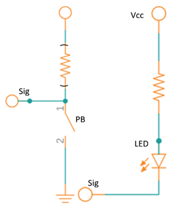

以下のようにはんだ付けし熱収縮チューブで被覆します。

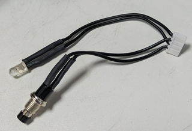

#### ADC
Raspi5ではI2Cを通してADCを接続し、PSDからのアナログ値を距離に変換して使用します。


[ADC購入先](https://www.amazon.co.jp/Walfront-1%E5%80%8BADS1115-16%E3%83%93%E3%83%83%E3%83%88I2C-ADC%E9%96%8B%E7%99%BA%E3%83%9C%E3%83%BC%E3%83%89%E3%82%A2%E3%83%8A%E3%83%AD%E3%82%B0-%E3%83%87%E3%82%B8%E3%82%BF%E3%83%AB%E3%82%B3%E3%83%B3%E3%83%90%E3%83%BC%E3%82%BF%E3%83%A2%E3%82%B8%E3%83%A5%E3%83%BC%E3%83%ABUSB%E3%83%9E%E3%82%A4%E3%82%AF%E3%83%AD%E3%82%B3%E3%83%B3%E3%83%88%E3%83%AD%E3%83%BC%E3%83%A9%E9%96%8B%E7%99%BA%E3%83%9C%E3%83%BC%E3%83%89%E4%BA%92%E6%8F%9B/dp/B07J18B4TS/?_encoding=UTF8&pd_rd_w=tWPoF&content-id=amzn1.sym.06fd1b66-f9f8-45c4-a23d-77acb62e93bd%3Aamzn1.symc.ba9f62aa-0e9e-47cb-ae63-bd23599fbe66&pf_rd_p=06fd1b66-f9f8-45c4-a23d-77acb62e93bd&pf_rd_r=NRWXM6754F779TBHXDKY&pd_rd_wg=g8omC&pd_rd_r=e1946fe4-ea83-4852-9c9e-581b4565afcf&ref_=pd_hp_d_atf_ci_mcx_mr_ca_hp_atf_d)

### battery
Zeeeのバッテリーは比較的安定して使用できます。10個1年使用して今のところ問題ありません。
1350mAhのバッテリーを使用できます。2200mAhのバッテリーも搭載可能です。


## servo:KRS3301/KRS3304-R2
KRS-3300シリーズのすべてのサーボモーターを使用できると同時にバッテリー(Lipoバッテリー2セル/7.4Vなど)は自由に自己責任で使用できます。
サーボモータについては通常KRS-3301を使用します。倒立伸子を行う場合はKRS3304-R2を使うと良いでしょう。
サーボの設定はROBO-ONE Beginners autoと同じとしますがトルク特性は以下のように少し変更した方がシミュレーションと会わせやすいでしょう。


[サーボ購入先](https://kondo-robot.com/product/krs-3304r2-ics)

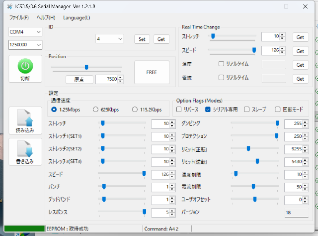

---
#### BTE100Bのconfig.txtに追記する情報

プッシュスイッチを押下するとログアウト
```
[all]
dtoverlay=gpio-shutdown,gpio_pin=17
dtoverlay=gpio-poweroff,gpiopin=4,active_low=1
```
LinuxをGUIで起動している場合は、プッシュスイッチを押下するとログアウトのプロンプトが表示され、タイムアウトするかダイアログのpower offを選択するまでシャットダウンが行われません。プッシュスイッチ操作によってシンプルにシャットダウン処理を行わせるには、GNOMEの設定を変更する必要があります。なおログインしていない状態ではこの設定は効果がありません。

```
gsettings set org.gnome.SessionManager logout-prompt false
```
冷却ファンのON-OFF
```
[all]
dtoverlay=gpio-fan,gpiopin=19,temp=50000
temp=50000は50℃で冷却ファンをONする意味で、摂氏度の1000倍の値を指定
設定温度を10℃下回るとファンはOFFする
```
RTC
```
[pi5]
dtparam=rtc=off
[all]
dtparam=i2c_arm=on
dtoverlay=i2c-rtc,ds3231
```
UART
```
[pi3]
init_uart_clock=64000000
dtoverlay=uart0=on
dtoverlay=pi3-miniuart-bt
 
[pi4]
init_uart_clock=64000000
#UART1を活性化
dtoverlay=uart1,txd1_pin=14,rxd1_pin=15
#UART2を活性化
dtoverlay=uart2,txd2_pin=0,rxd2_pin=1
#UART4を活性化
dtoverlay=uart4,txd4_pin=8,rxd4_pin=9
使用するポートのみを活性化する事を推奨。Linux上でのデバイス名は概ねttyAMAのプレフィクスで始まる。
またRaspberry Pi 3/Zeroの場合はcmdline.txtに記述されている「console=serial0,115200」を削除する事
```


## 製作費を抑えた低コストバージョン

最近は半導体の価格が上がっているため、できるだけコストを抑えて製作できる方法を検討しました。
また、これまでのモデル（auto）からの移行もスムーズに行えるよう、共通で使える部品を可能な限り採用しています。

---

### メモリ（RAM）の見直しによるコスト削減

Raspberry Pi 5 は搭載されているメモリ容量によって価格が大きく変わります。
今回のように **RAM 2GB や 1GB のモデルを選ぶことで、本体費用をぐっと安く抑えることが可能**です。
もし運用中にメモリが足りなくなった場合でも、**画像処理の解像度を少し落とすなどの工夫で十分対応できる**見込みです。

---

### 部品の購入先リンク

製作に必要な部品の購入先一覧です。

* **Raspberry Pi 5 (2GB RAM)**
[Amazonで購入する](https://www.amazon.co.jp/Raspberry-Pi-SC1110-5-2GB-RAM%E3%80%82/dp/B0DDL91V2R/ref=pd_sbs_d_sccl_2_4/357-8833739-4619627?pd_rd_w=kJzAt&content-id=amzn1.sym.d9975236-2c6f-40f8-8a79-8a86a96a4ad2&pf_rd_p=d9975236-2c6f-40f8-8a79-8a86a96a4ad2&pf_rd_r=20QCBEV2B84FWB3FKYNG&pd_rd_wg=8sHsI&pd_rd_r=36f9c6b5-6a24-4e84-bd3b-1a0c01cfd437&pd_rd_i=B0DDL91V2R&psc=1)
* **Raspberry Pi 5 (1GB RAM)**
[Amazonで購入する](https://www.amazon.co.jp/Raspberry-Pi-1GB-RAM-%E3%80%82/dp/B0G668D1R8/ref=sr_1_9?__mk_ja_JP=%E3%82%AB%E3%82%BF%E3%82%AB%E3%83%8A&crid=22IGQZJLS4OCX&dib=eyJ2IjoiMSJ9.A0DULReHZPWL7TQ3wzLTcIvL3cV6uGX3PM5fr8flxd46adyCbl5IKX1vEOQcYguWtbW204rYR_-gwprELNIkLz36m5N_5L4MVFaCzNmWDuT99C5clI0lPJ-gHJiYqntkuYgwd5qkaGffIrTvE1r0YkntguONYFuJsXGvEkT7TBgxoPAdqO1yu5btU7ygUV1S.mkATeVxliJw2DiAXln4QxPjNZWOLqTBBSOrIChXHt2E&dib_tag=se&keywords=raspi5+1g&qid=1785573711&s=electronics&sprefix=raspi5+1g%2Celectronics%2C171&sr=1-9&ufe=app_do%3Aamzn1.fos.35785624-70c4-44ae-a5c3-3f044f475d63)
* **高効率 8A DC-DC 降圧コンバータボード（25V → 3.3V/5V/9V/12V）**
[AliExpressで購入する](https://ja.aliexpress.com/item/1005009516551580.html?invitationCode=dE9zNEg5TmdKaVRZM25SSGZRK2lqVVJBdk92VnQ4R0pLbVJRSE91aHMvTWpmdlBzNkVmWTlBPT0&srcSns=sns_Gmail&spreadType=socialShare&social_params=6000472165432&bizType=ProductDetail&spreadCode=dE9zNEg5TmdKaVRZM25SSGZRK2lqVVJBdk92VnQ4R0pLbVJRSE91aHMvTWpmdlBzNkVmWTlBPT0&aff_fcid=5786875ea9b24ca3a9b13708a5f3a053-1785575311533-03912-_c4CGp9K7&tt=MG&aff_fsk=_c4CGp9K7&aff_platform=default&sk=_c4CGp9K7&aff_trace_key=5786875ea9b24ca3a9b13708a5f3a053-1785575311533-03912-_c4CGp9K7&shareId=6000472165432&businessType=ProductDetail&platform=AE&terminal_id=fec46efb2d5147d8a769291a9f9e1a6d&afSmartRedirect=y)

---

### 構成と写真のご案内

写真と合わせて配線や接続のイメージをご確認ください。

* **構成全体写真**
ファン付きの Raspberry Pi 5 に、5V電源・IMU（慣性計測装置）・シリアル変換ボード・サーボ分配器を取り付けた状態です。IMU（慣性計測装置）・シリアル変換ボード・サーボ分配器はautoのものを使用します。

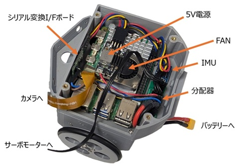

* **実態配線図**
Raspberry Pi 5 に5V電源、シリアル変換ボード、サーボ分配器を接続した配線図です。

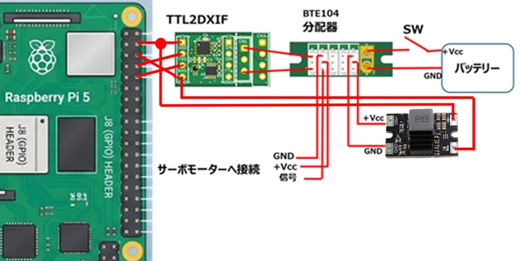

* **IMU接続写真**
Raspberry Pi 5 に IMU を I2C 接続した様子です。

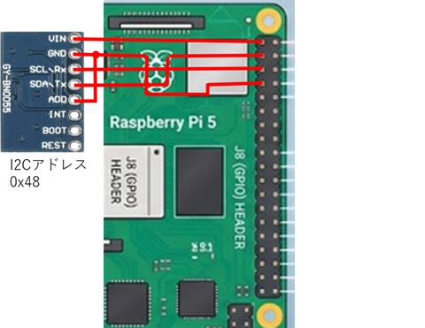

---

### 組み立てのコツと注意点

* **組み立てやすさ**
はんだ付けを行う箇所は数か所だけですので、電子工作が初めての方や初心者の方でも比較的簡単に作ることができます。
* **パーツの固定方法**
* **サーボ分配器：** 固定用のボスが付いているため、ビス（ネジ）でしっかり固定できます。
* **その他のボード：** ショートを防ぐため、絶縁に気を付けながら両面テープ等で固定してください。


* **プログラムの互換性**
I2Cアドレスおよびシリアルポートの設定は HAT（拡張基板）を使用した時と同じになっています。そのため、**既存のプログラムをそのまま変更せずに動かすことが可能**です。


