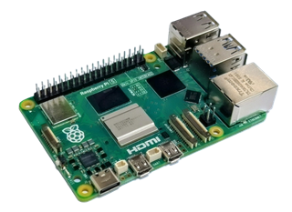
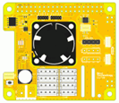
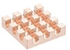
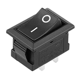
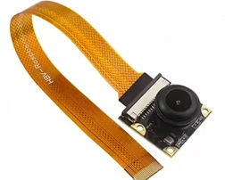
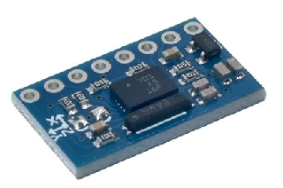
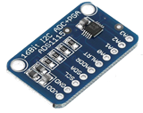
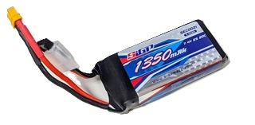

# Electronic_Circuit
## 概要
- cpu: Raspi5 16M csi
- Hat:電源 serial i2c fan rtc

### 全体図
まずはカメラとIMUでどこまでいけるかトライしてみたいと思います。TofセンサーとPSDセンサーは搭載していません。必要なら搭載できるようBKTは準備しました。



### Raspi5
ここではRaspi5を使用します。Raspi4でもほとんどのサンプルは動作しますが遅くです。スタートとして使用するには可能です。メモリーは4G以上あればよ良いでしょう。


https://www.amazon.co.jp/dp/B0CPDJ8FNK?ref=ppx_yo2ov_dt_b_fed_asin_title

### Hat
#### BTE100B DXHAT


[DXHAT購入先](https://www.besttechnology.co.jp/modules/knowledge/?BTE100B%20DXHAT)

#### HeatSink


[Raspi5購入先](https://www.amazon.co.jp/dp/B0F8V6TK9M?ref=ppx_yo2ov_dt_b_fed_asin_title&th=1)

#### 電源SW


[sw購入先]()

### CSI camera



#### camera: csi

#### Flexible cable
[sw購入先](https://www.amazon.co.jp/dp/B0DNFP5QJR?ref=ppx_yo2ov_dt_b_fed_asin_title&th=1)

### 入出力
#### bno055


#### push sw　および LED
push sw　および LEDはROBO-ONE Beginners autoと同じものを使用します。

amazonでも入手できます。
[sw購入先](https://www.amazon.co.jp/dp/B0D4PX1V4Q?ref=ppx_yo2ov_dt_b_fed_asin_title)

#### ADC
Raspi5ではI2Cを通してADCを接続し、PSDからのアナログ地を距離に変換して使用します。



[sw購入先](https://www.amazon.co.jp/Walfront-1%E5%80%8BADS1115-16%E3%83%93%E3%83%83%E3%83%88I2C-ADC%E9%96%8B%E7%99%BA%E3%83%9C%E3%83%BC%E3%83%89%E3%82%A2%E3%83%8A%E3%83%AD%E3%82%B0-%E3%83%87%E3%82%B8%E3%82%BF%E3%83%AB%E3%82%B3%E3%83%B3%E3%83%90%E3%83%BC%E3%82%BF%E3%83%A2%E3%82%B8%E3%83%A5%E3%83%BC%E3%83%ABUSB%E3%83%9E%E3%82%A4%E3%82%AF%E3%83%AD%E3%82%B3%E3%83%B3%E3%83%88%E3%83%AD%E3%83%BC%E3%83%A9%E9%96%8B%E7%99%BA%E3%83%9C%E3%83%BC%E3%83%89%E4%BA%92%E6%8F%9B/dp/B07J18B4TS/?_encoding=UTF8&pd_rd_w=tWPoF&content-id=amzn1.sym.06fd1b66-f9f8-45c4-a23d-77acb62e93bd%3Aamzn1.symc.ba9f62aa-0e9e-47cb-ae63-bd23599fbe66&pf_rd_p=06fd1b66-f9f8-45c4-a23d-77acb62e93bd&pf_rd_r=NRWXM6754F779TBHXDKY&pd_rd_wg=g8omC&pd_rd_r=e1946fe4-ea83-4852-9c9e-581b4565afcf&ref_=pd_hp_d_atf_ci_mcx_mr_ca_hp_atf_d)

### battery
Zeeeのバッテリーは比較的安定して使用できます。10個1年使用して今のところ問題ありません。
1350mAhのバッテリーを使用できます。2200mAhのバッテリーも搭載可能です。



## servo:KRS3304-R2
KRS-3300シリーズのすべてのサーボモーターを使用できると同時にバッテリー(Lipoバッテリー2セル/7.4Vなど)は自由に自己責任で使用できます。
サーボモータについては通常KRS-3301を使用します。倒立伸子を行う場合はKRS3304-R2を使うと良いでしょう。

---
#### config.txtに追記する情報
```
[all]
dtoverlay=gpio-shutdown,gpio_pin=17
dtoverlay=gpio-poweroff,gpiopin=4,active_low=1
```
ubuntuをGUIで起動している場合は、プッシュスイッチを押下するとログアウトのプロンプトが表示され、タイムアウトするかダイアログのpower offを選択するまでシャットダウンが行われません。プッシュスイッチ操作によってシンプルにシャットダウン処理を行わせるには、GNOMEの設定を変更する必要があります。なおログインしていない状態ではこの設定は効果がありません。

```
gsettings set org.gnome.SessionManager logout-prompt false
```

#### config.txtに追記する情報
```
[all]
dtoverlay=gpio-fan,gpiopin=19,temp=50000
temp=50000は50℃で冷却ファンをONする意味で、摂氏度の1000倍の値を指定
設定温度を10℃下回るとファンはOFFする
```

### config.txtに追記する情報

```
[pi5]
dtparam=rtc=off
[all]
dtparam=i2c_arm=on
dtoverlay=i2c-rtc,ds3231
```

#### config.txtに追記する情報
```
[pi3]
init_uart_clock=64000000
dtoverlay=uart0=on
dtoverlay=pi3-miniuart-bt
 
[pi4]
init_uart_clock=64000000
#UART1を活性化
dtoverlay=uart1,txd1_pin=14,rxd1_pin=15
#UART2を活性化
dtoverlay=uart2,txd2_pin=0,rxd2_pin=1
#UART4を活性化
dtoverlay=uart4,txd4_pin=8,rxd4_pin=9
使用するポートのみを活性化する事を推奨。Linux上でのデバイス名は概ねttyAMAのプレフィクスで始まる。
またRaspberry Pi 3/Zeroの場合はcmdline.txtに記述されている「console=serial0,115200」を削除する事
```
