# Mechanical_Design

## 全体デザイン

外形はauto型と同じですがCPUはRaspi5に替わり、カメラが搭載されます。シャーシとアームサーボ受け部は部品点数の低減と組み立て整備性の改善を図りました。

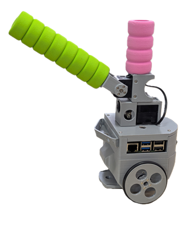

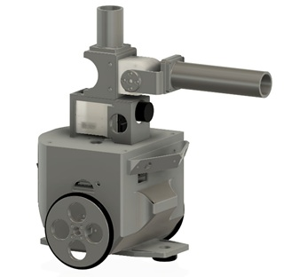

### CPU case

Raspi5を使用し深層学習を走らせることから冷却系の考慮とバッテリへの容量アップが搭載可能なものとしました。

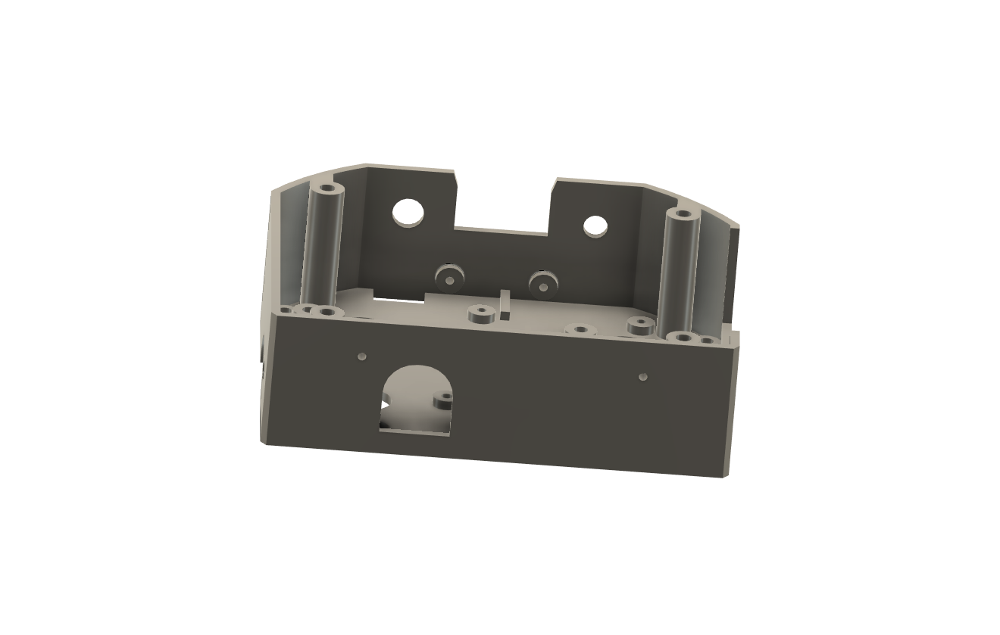
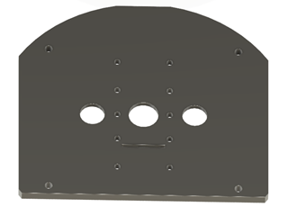

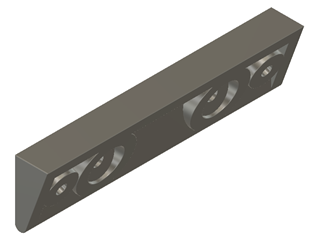
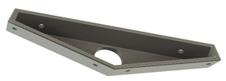

### Wheel
wheelは1partsとしました。O-ringを入れることで完成です。

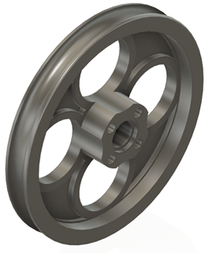
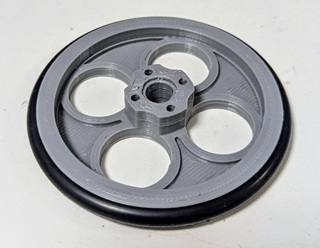

O-ringは以下より購入可能です。

[O-ring](https://www.amazon.co.jp/dp/B07W3BR9TY?ref=ppx_yo2ov_dt_b_fed_asin_title&th=1)

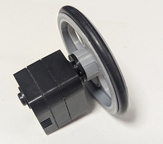 
  
### シャーシ
キャスタ
カグスベールを取り付ける。
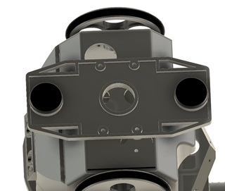
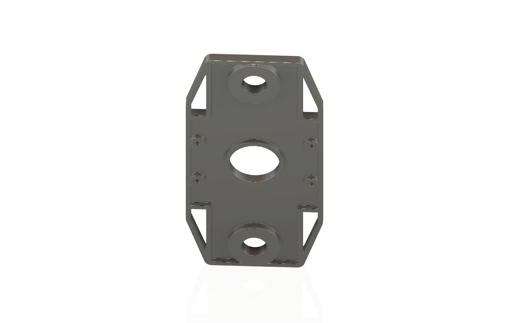
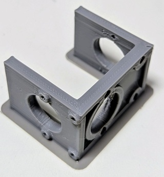

### body
モノコックとし、サーボを自由にセットできるようにしました。これは容量の大きなバッテリーの搭載が可能な形状としました。

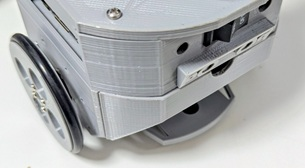
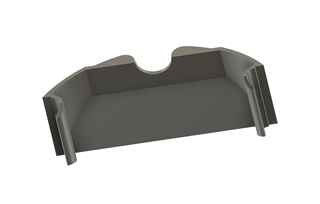
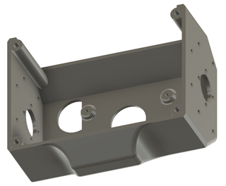

 Amazon
### CPU cover
### yhoo servo bkt
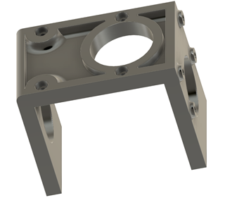

### tilt bkt
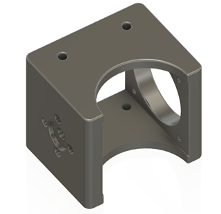

### arm bkt
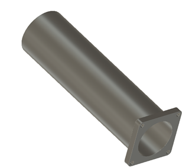

### PSDセンサーBKT

### armとHeadは同じ

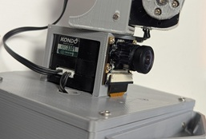
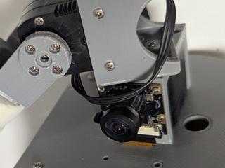

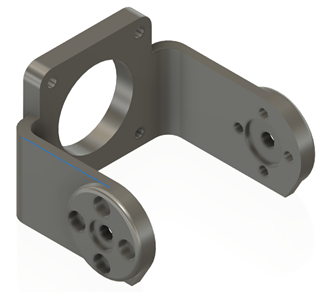
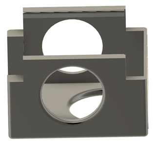

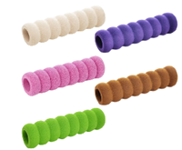
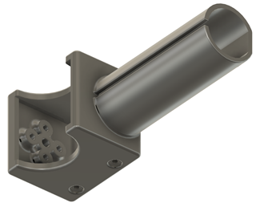

---
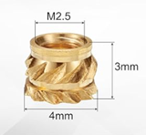
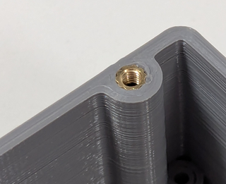
---

  
### stlデータ
