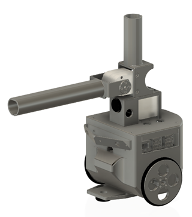
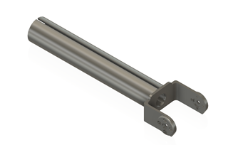
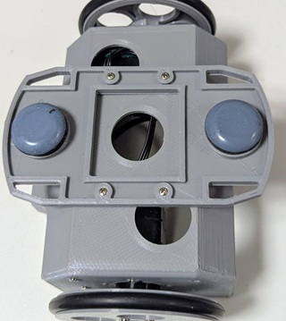
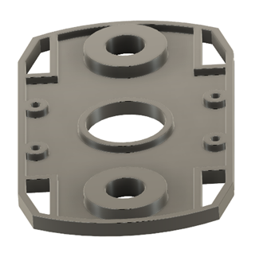
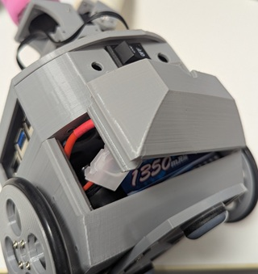

### ROBO-ONE_Beginners_VisionAI
# Mechanical_Design

## 1.コンセプト
このロボットはRaspberry Pi 5を使った画像処理やAIの学習向けの初心者のためのロボットです。
外形はROBO-ONE Beginners auto型と同じですがCPUはRaspi picoからRaspi-5に替わり、カメラが搭載されます。足回りとアーム部は部品点数の低減と組み立て性の改善を図りました。Raspi5を使用し深層学習を走らせることから電力消費増と発熱への対応とバッテリの容量アップ品の搭載が可能なものとしました。
#### 全体写真

#### 3D図

## 2.CPU case
外形はROBO-ONE Beginners autoのpico CPU caseと同じサイズとしました。後部のPSDブラケットはCPU caseと一体化、前方は分離型のままでTofセンサーBKTは廃止しカメラで対応することとします。
#### CPU case
CPU case cover締め付けボスに2.5mmインサートを挿入しておきます。挿入方法はROBO-ONE Beginners autoと同じですのでご参照ください。
CPUはM2.5-8mmのねじでケース下より締め付けます。事前にCPUとハットマウント用ディスタンスをねじM2.5-4mmのねじで締め付けておきます。

### PSD BKT
PSD BKTはCPU caseにM2-5mmのスクリューねじでねじ止めします。

### CPU case cover
CPU case coverはCPU caseに4本のM2.5-8mmで締め付けます。更にアームまわりを搭載します。

## 3.アーム廻り
アーム廻りは写真のように組み立てます。

#### Pan servo bkt
Pan servo bktにはPan用サーボモーターを4本のM2-5mmで締め付けます。CPU case coverとPan servo bktは4本のM2-10mmスクリューねじで締め付けます。

Pan_standを3dプリンターで製作する場合はBrimをつけ、横方向からプリントするようにします。

#### Tilt_bkt and Head
Tiltサーボモーターの固定とヘッドを一体化しました。

#### arm
アームとBKTを一体化しました。

### Head と Arm

Head部とArm部には安全や器物保護のためスポンジのドアノブカバーを使用します。
ピンクと紫は半分に切ってHead部に使用します。赤コーナーの場合はピンク、青コーナーは紫です。その他の色はArmに使ってください。Head部は交換しやすくするために締め代を少なくしています。

  

[購入先](https://amzn.asia/d/89CXsD9) 

### カメラの取り付け
カメラの取り付けは4本のM2-5mmのスクリューねじで締め付けます。

#### camera cover
Camera coverはパチッというまで押し込むと固定されます。

### 4.足回り

ロボットのセンサー、電子回路、ソフトウェアは自由に変更できるものとします。またKRS-3300シリーズのすべてのサーボモーターを使用できると同時にバッテリー(Lipoバッテリー2セル/7.4Vなど)は自由に自己責任で使用できます。

### Wheel
wheelは1partsとしました。O-ringを入れることで完成です。

O-ringは以下より購入可能です。

[5個入り Oリング ニトリルゴム 50mm x 60mm x 5mm ブラック](https://www.amazon.co.jp/dp/B07W3BR9TY?ref=ppx_yo2ov_dt_b_fed_asin_title&th=1)

サーボモータにはサーボホーンに直接取り付けることができます。ねじはM2-12mmを使用してください。
 
  
### シャーシ
キャスタにはカグスベールを採用しました。滑りやすくなり走行抵抗や走行音が少なくなりました。カグスベールはシャーシのキャスター取り付け部の丸い部分のセンターに取り付けてください。ボディとの取り付けは2mのスクリューねじで取り付けます。

### body
モノコックとし、サーボモータを90度毎に自由にセットできるようにしました。これにより容量の大きなバッテリーの搭載が可能となります。
リチウムポリマーの7.4V2000mAH程度のバッテリーの搭載が工夫次第で可能です。
CPUケースの取り付けボス部はねじを埋め込みます。
CPUカバーの締め付けを繰り返すとねじが馬鹿になるのでインサートを使用しました。M2.5を使用しています。

[動画](https://www.youtube.com/shorts/zL2C9oKePpQ)

バッテリの交換性向上のためねじ取り付けはやめ、パッチンと挿入できるようにしました。バッテリーを取り際したらカバーを下部より押し込んでください。外すときは上部の半円の切り欠き部に指を入れ引っ張り外してください。

### stlデータ
3dprinterで使用できるstlファイルはstlフォルダーにありますのでご利用ください。
