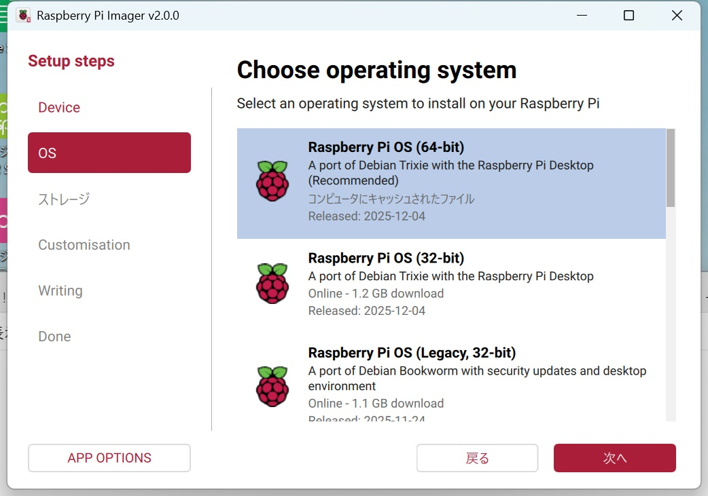

### ROBO-ONE_Beginners_VisionAI
# Software
## コンセプト
このロボットはRaspberry Pi 5を使用した初心者向けのVision AI型ロボットです。最新のAIライブラリを活用し、物体認識などの機械学習や、シミュレーションを用いた強化学習を学ぶことができます。

## ハード / OS / I/O 概要

* **CPU**: Raspberry Pi 5 (Memory 4GB以上推奨)
* **OS**: Raspberry Pi OS Trixie (Debian 13) 64-bit
* **言語**: Python 3.11以降
* **通信プロトコル**:
　* **Serial (UART)**: サーボモーター制御用 (KRSサーボ等)
　* **I2C**: IMU (慣性計測装置) / ADC (アナログ-デジタル変換) 用

## Install 手順
### 1. SDカードの作成
Raspberry Pi Imagerを使用し、Device:Raspi5 OS:Trixieを選択します。



* **OS**: Raspberry Pi OS (64-bit) Trixie
* **設定**: 書き込み時に「OSカスタマイズ」でホスト名、Wi-Fi、SSHを有効にしておくと、その後の作業がスムーズです。

### 2. OSとConfigの設定

Raspberry Pi 5を起動し、ターミナルで以下の設定を行います。

#### インターフェースの有効化

`sudo raspi-config` を実行し、以下の項目を **Enable** にします。

* Interface Options -> **I2C**
* Interface Options -> **Serial Port** (Login shell: No / Hardware: Yes)
* Interface Options -> **VNC** (必要に応じて)

#### Raspberry Pi Connect のセットアップ

ブラウザ経由でリモートデスクトップ操作を可能にします。

```bash
sudo apt update
sudo apt install rpi-connect
# インストール後、画面右上のアイコンまたはコマンドでサインイン

```

#### 冷却ファンの設定

`sudo nano /boot/firmware/config.txt` を開き、末尾に追記します。

```text
[all]
dtoverlay=gpio-fan,gpiopin=19,temp=50000

```

> **Note**: `temp=50000` は50℃でファンが始動することを意味します。AI処理中は発熱が激しいため、この設定は必須です。

### 3. I/O関係の接続確認

接続されたデバイスが認識されているか確認します。

```bash
# I2Cデバイスの確認（アドレスが表示されればOK）
i2cdetect -y 1

# シリアルポートの確認
ls /dev/ttyAMA0

```

## 開発環境（venv）の構築

OS標準のPython環境を汚さないよう、仮想環境（venv）を使用します。Trixieでは `pip install` を直接行うとエラーになるため、この手順は必須です。

### 仮想環境の作成と有効化

```bash
sudo apt update && sudo apt upgrade -y
mkdir ~/robot_project
cd ~/robot_project

# システムパッケージ（Picamera2など）を共有して作成
python3 -m venv venv --system-site-packages

# 有効化（作業開始時に毎回実行）
source venv/bin/activate
```
### 必要なライブラリのインストール
シミュレーション環境や画像処理のライブラリーをインストールします。mujocoやYoloがRaspi5でも使えます。

```bash
pip install --upgrade pip
pip install ultralytics  # YOLO (物体認識)
pip install mujoco gymnasium stable-baselines3  # 強化学習セット
pip install numpy

```
* Yolo26: `ultralytics` を入れることで、OpenCVも導入されるので、カメラ映像から即座にリアルタイム物体検知や処理が可能になります。
* 起動時自動実行: ロボットとして自律動作させる場合は、`systemd` を使って venv 内の python スクリプトを自動起動する設定を追加すると便利です。
* 電力不足注意: Raspberry Pi 5は 5V/5A の電源を推奨します。AI処理中にカメラやサーボを動かすと電圧降下（低電圧警告）が発生しやすいため、高品質な電源を使用してください。

---
## カメラ（rpicam-apps / Picamera2）の使い方
Raspberry Pi 5では従来の `raspistill` ではなく `rpicam-apps` を使用します。

### 基本コマンド
* プレビュー表示: `rpicam-hello -t 0`
* カメラ一覧確認: `rpicam-hello --list-cameras`
* 静止画保存: `rpicam-still -o test.jpg`

### Pythonでの画像処理
OpenCVとPicamera2を組み合わせる際、色の並び（色空間）に注意が必要です。
* 色の変換: Picamera2は RGB形式で画像を取得しますが、OpenCV（cv2）はBGR形式として処理します。
```python
# 変換例
import cv2
img_bgr = cv2.cvtColor(img_rgb, cv2.COLOR_RGB2BGR)
```
* フォーマット: メモリ効率を上げるため、`format='RGB888'` を指定してキャプチャすることを推奨します。
---
## YOLO11の使用方法

YOLOはどんどん進化しており、簡単にインストールでき、使用できる便利な物体認識の深層学習手法です。また最近エッジおよび低電力デバイス向けに設計されたYOLO26も使えます。

[Yolo26](https://docs.ultralytics.com/ja/models/yolo26/)

pi-cameraのsample programを以下に置きました。

example/etc/picamcam.py

以下はYolo11の物体認識のプログラムです。

example/etc/inf11_cam.py

---

## KRSのコントロール
krs-driver_rp5.pyはROBO-ONE Beginners autoのシリアルポートを変更したものです。使い方は同じです。

## IMU I2C取り込み
BNO055をi2cのボートと使用するライブラリーを変更すれば、使用方法はROBO-ONE Beginners autのものと同じです。

## ADC PSD取り込み
Raspi5にはADCが無いので、i2c接続のADCを使用します。
Raspberry Pi 5（ラズパイ5）で高性能な16bit ADC（アナログ-デジタルコンバータ）である**ADS1115**を使用する方法を解説します。
ラズパイ5では、これまでのモデルと異なりGPIOの制御方式が変更されていますが、Pythonのライブラリ（Adafruit CircuitPython）を使用すれば、従来通り簡単に扱うことができます。

### 1. 配線（接続方法）

ADS1115は**I2C**プロトコルを使用します。ラズパイ5のピン配置に合わせて以下のように接続してください。

| ADS1115 ピン | Raspberry Pi 5 ピン | 役割 |
| :--- | :--- | :--- |
| **VDD** | 3.3V (Pin 1) | 電源 (3.3V推奨) |
| **GND** | GND (Pin 9) | グラウンド |
| **SCL** | SCL (Pin 5) | I2C クロック |
| **SDA** | SDA (Pin 3) | I2C データ |
| **ADDR** | GNDへ接続 | I2Cアドレスを `0x48` に設定 |

### 2. ラズパイの設定

まず、I2Cインターフェースを有効にする必要があります。

1.  ターミナルで `sudo raspi-config` を実行。
2.  **Interface Options** -> **I2C** を選択し、**Yes** を選んで有効化します。
3.  再起動後、正しく認識されているか確認します。
    ```bash
    ls /dev/i2c*
    ```
    `/dev/i2c-1` が表示されればOKです。

### 3. ライブラリのインストール

ラズパイ5では、Python環境の競合を避けるために**仮想環境（venv）**の使用が推奨されています。

```bash
# 仮想環境の作成と有効化
python -m venv env
source env/bin/activate

# 必要なライブラリのインストール
pip install adafruit-circuitpython-ads1x15
```
### 4. Pythonコードの例
以下のコードは、`A0`ピンに入力された電圧を読み取り、コンソールに表示するシンプルな例です。

```python
import time
import board
import busio
import adafruit_ads1x15.ads1115 as ADS
from adafruit_ads1x15.analog_in import AnalogIn

# I2Cバスの初期化
i2c = busio.I2C(board.SCL, board.SDA)

# ADS1115オブジェクトの作成
ads = ADS.ADS1115(i2c)

# A0ピンをアナログ入力として設定
chan = AnalogIn(ads, ADS.P0)

print(f"{'電圧(V)':>10} {'数値':>10}")
print("-" * 25)

try:
    while True:
        # chan.value は 0-65535 の範囲 (16bit)
        # chan.voltage は 実際の電圧
        print(f"{chan.voltage:10.4f}V {chan.value:10}")
        time.sleep(0.5)
except KeyboardInterrupt:
    print("\n終了します")
```

知っておくと役立つポイント
* ゲイン（増幅率）の設定:
    デフォルトでは最大4.096Vまで測定可能です。これより小さい電圧を精密に測りたい場合は、`ads.gain = 2`（最大2.048V）のように設定変更できます。
* 差動入力:
    2つのピンの電圧差を測る場合は、`AnalogIn(ads, ADS.P0, ADS.P1)` のように指定します。
* サンプリングレート:
    `ads.data_rate = 860` と設定することで、秒間最大860回の高速サンプリングが可能です。
---

## Game controllerの接続
RaspiOSに接続します。Raspi ConnectからRaspiに接続します。Bluetoothを探して接続します。いろいろなコントローラーが接続できると思います。
ここでは8bitDo lite2に接続します。


[購入先](https://www.amazon.co.jp/8BitDo-Lite-Switch%E3%80%81Switch-Lite%E3%80%81Android%E3%80%81Raspberry-Pi%EF%BC%88%E3%82%BF%E3%83%BC%E3%82%B3%E3%82%A4%E3%82%BA%EF%BC%89%E7%94%A8%E3%81%AEBluetooth%E3%82%B2%E3%83%BC%E3%83%A0%E3%83%91%E3%83%83%E3%83%89/dp/B0B3DH1Z4P/ref=sr_1_3?crid=4B52DUKP1FMS&dib=eyJ2IjoiMSJ9.OMgXZbW6349e7O7MSB6-boH0speacDqBwPyCqMBf8kqQS91cf1NXrwDR8bop-pMxCByB9-rhUF1bvGedgOv1g39QDIIa9sYMVetsjntBhDSK_hW6-0XKEtY26uIXDCuMN7U81XNcx55nFOblcnEwi5SFKfV_DLcoVCtYKewDDWDrqrx7unY3d-oqm0cA6zPx-TH8vGpixUyHmJj9iwIB6sENaFylXbZrnDXNFGfPdcoLssHpvBl25dhW0HUno7fiID_TmOX3Ij7j7z7VuqhMDPu1Vrwp2taQFFCOaVFeJww.ziKejo1l-pDi-VHxZyEiwckld2h1psHbQk91X7XGRIQ&dib_tag=se&keywords=8bitdo%2Blite2&qid=1776910895&sprefix=8bitdo%2Blite%2Caps%2C277&sr=8-3&ufe=app_do%3Aamzn1.fos.bf5b3200-08a5-4406-bf4b-e679e8ebbcc3&th=1)

#### Game controllerのサンプルプログラム
以下のプログラムは4軸のサーボモータをコントロールするprogramです。ここまでで出来れば操縦型で参加できます。

example/etc/joy.py
```python
import pygame
import time
import serial
from krs_driver_rp5 import * 
#servo id
id_r=1
id_l=2
id_pan=3
id_tilt=4
#
ct=7500
ct_pan=6128
ct_tilt=7500
#
krs=KRSdriver()
#
def arm(pan,tilt):
    krs.set_position_ret(id_pan,ct_pan+pan)
    krs.set_position_ret(id_tilt,ct_tilt-tilt)
#
def drive(r_sp,l_sp):
    krs.set_position_ret(2,ct-l_sp)
    krs.set_position_ret(1,ct+r_sp)
#
def free_all():
    krs.read_position_set_free(1)
    krs.read_position_set_free(2)
    krs.read_position_set_free(3)
    krs.read_position_set_free(4)  
#
def main():
	# Pygameの初期化（コントローラー用）
    pygame.init()
    pygame.joystick.init()
    while pygame.joystick.get_count() == 0:
        pygame.event.pump() # イベントキューを更新
        time.sleep(0.1)     # CPU負荷を抑えるための待機
    joystick = pygame.joystick.Joystick(0)
    joystick.init()
    print(f"Using: {joystick.get_name()}")
    #
    try:
        while(True) :
            pygame.event.pump()
            bu=joystick.get_button(0) # A
            bu2=joystick.get_button(1)# B
            bu3=joystick.get_button(3)# Y
            bu4=joystick.get_button(4)# Y
            bu6=joystick.get_button(6)# L1
            bu8=joystick.get_button(8)# L1
            if bu!=0: 
                drive(0,0)
            elif bu2!=0:
                free_all()
            elif bu6!=0:
                arm(int(5000*joystick.get_axis(2)),2800)
            elif bu8!=0:
                arm(int(5000*joystick.get_axis(2)),-3800)                
            else:
                fr=int(-300*joystick.get_axis(1))
                rf=int(100*joystick.get_axis(0))
                arm(int(5000*joystick.get_axis(2)),int(-5000*joystick.get_axis(3)))
                drive(fr-rf,fr+rf)
            time.sleep(0.01)
    except KeyboardInterrupt:
        print("\n終了します")
        pygame.quit()
        free_all()
#
if __name__ == "__main__":
    main()
```

---

## systemd による自動起動の設定手順
大会では電源を入れれば自動起動で操縦可能にします。

### 1. サービスファイルの作成

以下のコマンドで、新しいサービス設定ファイルを作成します（ファイル名は `my_robot.service` とします）。

```bash
sudo nano /etc/systemd/system/my_robot.service

```

### 2. 設定内容の記述

以下の内容をコピー＆ペーストしてください。各パスはご自身の環境に合わせて書き換えてください。

```ini
[Unit]
Description=My Vision AI Robot Service
After=network.target

[Service]
# 実行ユーザー（通常は pi）
User=nishi
# プログラムがあるディレクトリ
WorkingDirectory=/home/nishi/begin
# 仮想環境内のpythonパスを直接指定して実行
ExecStart=/home/nishi/begin/venv/bin/python3 /home/nishi/begin/rf/main.py
# 異常終了した時に5秒後に再起動する設定
Restart=always
RestartSec=5
# 標準出力（ログ）の送り先
StandardOutput=inherit
StandardError=inherit

[Install]
WantedBy=multi-user.target

```

### 3. サービスの有効化と起動

ファイルを保存（`Ctrl+O` -> `Enter`）し、エディタを終了（`Ctrl+X`）したら、以下のコマンドでシステムに反映させます。

```bash
# 設定の再読み込み
sudo systemctl daemon-reload

# 自動起動の有効化
sudo systemctl enable my_robot.service
# 無効化
sudo systemctl disable my_robot.service
# 今すぐ起動（テスト）
sudo systemctl start my_robot.service

```
### 4. 運用で役立つコマンド

自動起動を設定した後は、画面に何も表示されないため「本当に動いているか？」を確認する術を知っておく必要があります。

* **状態の確認**:
`systemctl status my_robot.service`
（実行中か、エラーで止まっているかが一目でわかります）
* **ログのリアルタイム確認**:
`journalctl -u my_robot.service -f`
（Pythonの `print()` 内容をリアルタイムで監視できます。デバッグに最適です）
* **停止・再起動**:
`sudo systemctl stop my_robot.service` / `sudo systemctl restart my_robot.service`---


---

## 【補足】Raspberry Pi Connect の導入・利用手順

Raspberry Pi Connectを使うと、ブラウザ越しにどこからでもRaspberry Piのデスクトップにアクセスできます。セットアップを以下のステップに分けて解説します。

### 1. 準備：OSのインストール

Raspberry Pi Connectを利用するには、OSのバージョンと種類が重要です。

* **OSの選択:** **Raspberry Pi OS (64-bit)** の最新版（Bookworm以降）をインストールしてください。
* ※Raspberry Pi 4 / 5 / 400 が推奨されています。
* ※デスクトップ版（Desktop）を選択してください（Lite版は非対応です）。


* **書き込み:** 公式の「Raspberry Pi Imager」を使ってmicroSDカード（またはSSD）に書き込み、Raspberry Piを起動します。

### 2. Raspberry Pi ID の作成

あらかじめ、管理用の公式アカウントを作成しておくとスムーズです。

* [Raspberry Pi ID 登録ページ](https://id.raspberrypi.com/) にアクセスし、メールアドレスでアカウントを作成・サインインしておきます。

### 3. Connect サービスの有効化（本体側の操作）

Raspberry Piが起動したら、機能をオンにします。

1. **インストール（必要な場合）:**
ターミナルを開き、念のため最新の状態に更新してインストールを確認します。
```bash
sudo apt update
sudo apt install rpi-connect

```

2. **機能を有効化:**
メニューの「設定」→「Raspberry Pi Configuration」→「Interfaces」タブの中に「Raspberry Pi Connect」という項目があれば **ON** にします。
（または、ターミナルで `systemctl --user enable rpi-connect` を実行します）

### 4. デバイスの紐付け（リンク）

ここが最も重要なステップです。

1. Raspberry Piのデスクトップ右上（タスクバー）に、Connectのアイコン（雲のようなマーク）が表示されます。
2. アイコンをクリックし、**[Sign In]** を選択します。
3. ブラウザが立ち上がり、「このRaspberry Piをあなたのアカウントに登録しますか？」という画面（Link Device）が表示されます。
4. **デバイス名を入力:** 自分が管理しやすい名前（例: `My-RasPi5` など）を付けて、[Link Device] ボタンを押します。

### 5. 外部から接続する

設定が完了したら、別のPCやスマホのブラウザから操作可能です。

1. 接続元PCのブラウザで [https://connect.raspberrypi.com/devices](https://connect.raspberrypi.com/devices) にアクセスします。
2. 自分のRaspberry Pi IDでサインインします。
3. 登録したデバイスの一覧が表示されるので、右側にある **[Connect]** ボタンをクリックします。
4. これでブラウザ内にRaspberry Piのデスクトップが表示されます！


